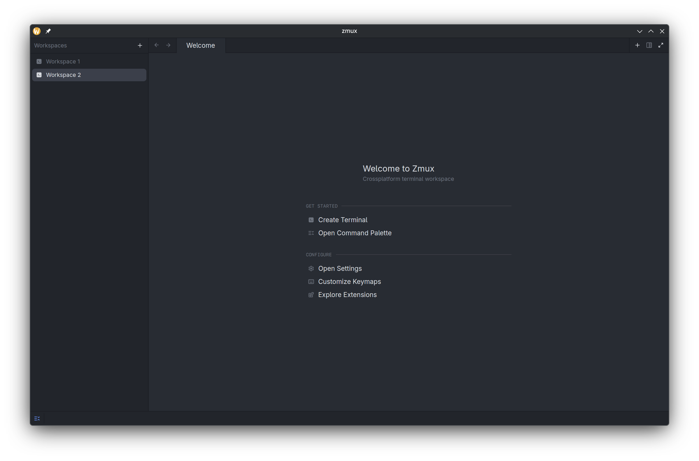

# zmux

A small GPUI terminal shell around Zed's `terminal` and `terminal_view` crates.



Run with:

```sh
cargo run -j 6 --release
```

Shortcuts:

- Copy: `Ctrl-Shift-C`, `Ctrl-Insert`, or `Cmd-C`.
- Paste: `Ctrl-Shift-V`, `Shift-Insert`, or `Cmd-V`.
- New terminal tab: `Ctrl-Shift-T` or `Ctrl-Shift-N`.
- New workspace: `Ctrl-Shift-E`. Toggle the workspaces sidebar: `Ctrl-Shift-B`.
- Notify the current terminal pane (manual test trigger): `Ctrl-Shift-M`.
- Jump to the latest unread notification: `Ctrl-Shift-U`.
- CLI: `zmux notify "Title" "Body"` or `zmux notify --title "Title" --body "Body"`. Terminals spawned by zmux inherit a private per-instance notification endpoint, so the command always reaches the zmux instance that launched that terminal.
- Zoom terminal font: `Ctrl-=`/`Ctrl-+`, `Ctrl--`, `Ctrl-0`; macOS-style `Cmd` variants are also bound.
- Plain `Ctrl-C` is intentionally left for the shell interrupt signal.

## Configuration and keymaps

Zmux has one versioned configuration document and never reads or writes a
Zed-owned settings or keymap path. Its platform-default location is:

- Linux and other XDG systems: `$XDG_CONFIG_HOME/zmux/config.json`, falling
  back to `$HOME/.config/zmux/config.json`.
- macOS: `$HOME/Library/Application Support/zmux/config.json`.
- Windows: `%APPDATA%\zmux\config.json` (with a `%USERPROFILE%` fallback).

Embedders/tests can inject a `ConfigPathProvider`; this is how the config layer
will plug into Zmux's shared path provider without coupling it to Zed paths.
The effective configuration is deterministic: built-in defaults are loaded
first, then the one Zmux config file is validated and applied. There is no
project-local config precedence and `allow_trusted_project_commands` remains
off by default; it is only a reserved policy field until an explicit trust
model exists.

Open **Settings** from the welcome page (or `Ctrl-,`) to edit the actual JSON
document in-app. **Customize Keymaps** (or `Ctrl-Shift-,`) opens the same
validated document with keymap-specific help. The editor has explicit **Save**,
**Reload**, and **Reset Defaults** controls. Zmux also polls its small config
file for changes, so a validated external edit applies live; a malformed edit
keeps the last known-good configuration active and is left on disk for repair.

The current schema is version 1:

```json
{
  "schema_version": 1,
  "keybindings": {
    "overrides": { "new_terminal": "ctrl-alt-t" },
    "disabled": ["quit"]
  },
  "terminal": {
    "font_family": null,
    "font_size": 14,
    "line_height": 1.2
  },
  "sidebar": {
    "starts_open": true,
    "show_metadata": true,
    "show_working_directory": true,
    "show_git_status": true,
    "metadata_refresh_seconds": 5,
    "max_log_entries": 100
  },
  "notifications": {
    "enabled": true,
    "show_unread_badges": true,
    "show_latest_summary": true
  },
  "automation": {
    "allow_cli_notifications": true,
    "allow_trusted_project_commands": false
  }
}
```

`keybindings.overrides` replaces all built-in shortcuts for that action;
`disabled` removes its built-in shortcuts. Valid action names are documented in
the Keymaps editor and include terminal copy/paste, workspace navigation,
tabs/panes, font zoom, notifications, and Settings/Keymaps/reload/reset.
Unknown fields, unknown actions, invalid key sequences, unsafe numeric ranges,
and future schema versions are rejected before they replace live state.

Pre-versioned development files are migrated deterministically: legacy
`shortcuts` becomes `keybindings.overrides`, and `terminal_font_size` becomes
`terminal.font_size`. The conversion is in memory until the user saves; Save
writes a canonical version-1 document through a same-directory temporary file
and rename. A future version is rejected rather than silently discarded.

## Workspace metadata

The workspace sidebar consumes a rendering-independent, bounded metadata store.
It tracks a working directory, best-effort Git state, listening-port capability,
agent activity, unread/latest notification state, scriptable status pills,
progress values, and retained logs. UI rendering does not run shell commands.

Background refreshes are short, cancellable, generation-checked jobs. A rapid
workspace switch or close cancels the old request; any late result is ignored.
Git status is collected portably with a bounded `git status` invocation. Linux
uses `ss` for a best-effort local listener list; unsupported platforms expose
an explicit unavailable state instead of failing the sidebar. Status/progress/
log primitives are addressed by immutable workspace IDs through
`WorkspaceMetadataStore::apply_update`, ready for the versioned control API.
All sidebar state also has textual labels/summaries rather than icon-only data.

## Workspaces

The left sidebar lists independent **workspaces**. Each workspace keeps its own
open terminal tabs *and* their split layout. Switching is instant: the active
workspace lives in the center pane group, while inactive ones are detached and
parked with their terminals still running (no PTY restart), so a build or watch
process keeps going in the background while you work elsewhere.

The first zmux window in a process restores the saved session. Additional
windows start with a fresh workspace and distinct workspace identities, so they
cannot duplicate the first window's live terminals or attach notifications to
the wrong workspace. They advance only a separate identity watermark; if the
session-owning window closes, later windows do not overwrite its richer saved
layout.

- Click **+** (or press `Ctrl-Shift-E`) to create a workspace.
- Click a workspace to switch to it.
- Double-click a workspace (or use the pencil button) to rename it inline.
- Drag a workspace up or down to reorder the list.
- Workspaces with unread agent notifications show a dot; the latest notification appears at the bottom of the sidebar.
- Use the trash button to close a workspace; the last one can't be closed.

## State isolation and reset

zmux intentionally does not read, write, or migrate Zed's user state. Settings,
sessions, databases, cache, and logs use the `Zmux`/`zmux` application namespace:

- Linux and FreeBSD: `$XDG_DATA_HOME/zmux`, `$XDG_CONFIG_HOME/zmux`,
  `$XDG_CACHE_HOME/zmux`, and `$XDG_STATE_HOME/zmux` (with the usual XDG
  defaults when those variables are unset).
- macOS: `~/Library/Application Support/Zmux`, `~/.config/zmux`,
  `~/Library/Caches/Zmux`, and `~/Library/Logs/Zmux`.
- Windows: `%LOCALAPPDATA%\Zmux` for data/state and `%APPDATA%\Zmux` for
  configuration.

To reset zmux, quit it and delete only the matching **zmux** directories above.
Do not delete or copy Zed's directories: zmux starts with a clean, independent
database and session store by design.

Build notes:

- `zmux` wraps Zed's GPUI terminal view, which pulls in substantial editor/workspace/UI code. The required Zed crates are fetched from `https://github.com/zed-industries/zed` at the pinned revision recorded in `Cargo.toml` and `Cargo.lock`
- Release builds strip symbols and use `panic = "abort"` to reduce artifact size without enabling slower size optimizations such as LTO by default.
- Linux and FreeBSD builds enable `gpui_platform`'s `font-kit`, `wayland`, and `x11` backends. macOS and Windows avoid those Linux display features in this crate's target-specific dependency configuration.
- Cross-platform builds still require the appropriate platform toolchain and native QA for GUI, PTY, clipboard, and font behavior.
- After `Cargo.lock` is committed, use `cargo build -j 6 --locked` and `cargo test -j 6 --locked` to reproduce the pinned dependency set.
